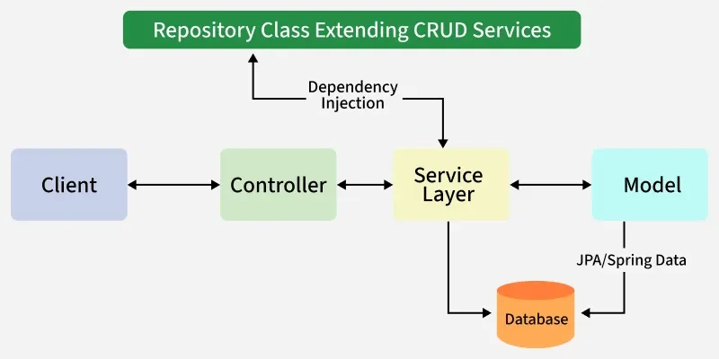

# SpringBoot

Spring Boot is a Java framework built on top of Spring that simplifies application development. It eliminates boilerplate code with auto-configuration. Spring Boot comes with an embedded server, making applications production ready out of the box. It supports web apps, REST APIs, microservices, security and seamless cloud deployment.



### Spring simplies many tasks like
* Creating web Application
* Working with Database
* Managing Transcations
  


## Task
### Overview
- Spring Boot Overview<br>
  - Understand Spring<br>
  - Spring Boot Advantage<br>
  - Auto Configuration<br>
### Setup
 - Create SpringBoot project via Spring Intializer<br>

 
### Annotation and Structure
 - @ SpringBootApplication
 - @ RestController
 - @ AutoWired
 - @ packages

### REST API Basics
 - Building REST APIs using Spring Web

### Confriguation & Properties
 - application.properties
 - enviroment variables

### Assignment
 <I>Building a Student Mangement REST APIs, using dependency injection and REST APIs</I>
 <ins> Assignment Prep Roadmap </ins>

Day 1–2 → Learn annotations (@SpringBootApplication, @RestController, @Service, @Autowired). <br>

Day 3–4 → Practice REST basics (CRUD with dummy in-memory list). <br>

Day 5–6 → Add database (H2 first, then MySQL/Postgres). <br>

Day 7 → Learn application.properties & environment-specific configs. <br>

Day 8–9 → Implement layered architecture (Controller → Service → Repository → DB). <br>

Day 10 → Add exception handling & validation. <br>

Day 11+ → Refactor into clean Student Management System. <br>
-----------------------------------------------

### Good to know basics of for a better Understanding
 - Dependency Injection
 - Spring Bean Cycle
 - POJO
 - Spring Core
 - Serverlet
---------------------------------------------------
### To have a complete understanding of Springboot and Java Backend Development
> JPA Annoation <br>
> Docker <br>
> Architecture <br>
> Unit Testing <br>
> Spring Security <br>
-----------------------------------------------------
# Documentation
### Auto-Config
* These are classes that already have boilerplate code for most types of database(<ins>Mongo</ins>, <ins>Casandra</ins>) Server codes so we save time in setting up any needed confriguation.

 Some Examples<br>
> TomcatAuto Config<br>
> DispatcherServlet Config<br>
> Java2JsonConvertorAutoConfig<br>

* We use a StarterApp to activate the bootstramp the program, we use the run method inside it to maintain docs
  ```
  class StarterApp{
    //SpringApplication.run(StarterApp,arg){
  }
  ```
  <I> <ins>ConditionalonClass -> </ins> So we make an condition that if only a serverlet class is needed that means it is a web based app and then <ins>only we need a tomcat Server</ins> </I>
  Example->
  ```
  ConditionalOnClass(Server.class)
  @Bean
  createTomcatServer(){
  //
  }
  ```
  Example->
  ```
  @ConditionalOnClass(DS.class)
  @Bean
  createDispatcherServlet(){
  //
  }
  ```
  ## Annotation
  <b> @SpringBootApplication </b> -
  - It is a combination of Three Annotation like @Confirguation, @EnableAutoConfriguation,@ComponentScan, @
  - The Annotaion is used only once in the whole SpringBoot Project, and is the main Startung class of the project
  - It does the work of @confriguation, @EnableAutoCOnfriguation @ComponentScan
  - We use SpringBootApplication annotation on the main class. This Single annotation replaces the need for Setting up a manual Spring Application context. <br>
  - We no longer need to explicitly create an application context using AnnotationCOnfigApllicatonContext as Spring Boot Handles that behind the secnes. <br>
  - The annotation alone brings in a lot of pre-configured feathures, including automatic component scanning and embedded server confriguation, which would requireed more steps in
    a Traditional Spring setup
  <b> @RestControllers </b> -
  - is a Spring annotation used to define a controller that handles HTTP requests and returns responses directly (usually JSON).
  ```
   @RestController
  public class HelloController {

    @GetMapping("/hello")
    public String sayHello() {
        return "Hello, Spring Boot!";
    }
  }
  ```

  <b> @AutoWired </b> -
- It is used for dependency Injection(DI) in Spring.
- It tells Spring to AUtomatically inject instance of a bean into your class.
- Avoids manual object creation -> Spring manages it for you
- Works on constructor, setter, or field injection.

```
@Service
public class StudentService(){
  public String Greet(){
    return "hello Student"
  }
}
@RESTController
@RequestMapping
public class StudentController(){
  private final StudentService studentservice;

@Autowired
public StudentController(StudentService studentservice){
  this.studentService = SudentService;
}

@GetMapping
public String greetStudent(){
  return StudentService.greet();
}
}


```
 ### Advance Java vs SpringBoot for Developemnt 
 * Advance Java usuallu compromises Servlets +JSP + JDBC
   - Less Boilerplate code
     * We first had to manually configure web.xml, Servlets,JSP,JDBC etc, SpringBoot has auto confriguation which handles most of it, you can Start REST APIs with just Annoation like @RestControllers and @GetMapping
   - Built in Server advantage
     * The SpringBoot eliminates the task of congiguring and running a Tomcat Server on its own, no need for manual deployment and easier developemnt
  - Annoation Driven Development
     * Relies heavily on XML Spring Boot uses annotaion like <ins>@Autowired, @Service, @RestComtrollers</ins>
  -  Database Integration
     * Uses JDBC mannually, whereas Spring supports Spring Data JPA, Hibernate etc, <ins>@Repository</ins> is enough to Start CURD Operations  

### Spring MVC vs SpringBoot
 ## Spring MVC
 Spring MVC Framework is a widely used tool for creating scalabale web application, It consits of multiples modules like <ins>Model, View, Controller, Front Controller </ins> 
 - Model - A model can be an object or collection of objects which basically contains the data of the application.
 - View - A view is used for displaying the information to the user in a specific format. Spring supports various technologies like freemarker, velocity, and thymeleaf.
 - Controller - It contains the logical part of the application. @Controller annotation is used to mark that class as a controller.
 - Front Controller - It remains responsible for managing the flow of the web application. Dispatcher Servlet acts as a front controller in Spring MVC.
  
Spring MVC confroguation are needed to be done manually, we need to define dependency indivisdually doesnt alllow powerful batch processing system unline Spring Boot


### Project Structure (SpringBoot)
> .idea <br>
- Is simply a file related to Intelij Idea
> .mvn <br>
- Is a Maven Wrapper class
> Src<br>
- main<br>
  - Java<br>
    Contains the Java code
  - Resources <br>
    <ins>Static</ins> is used to store things like images<br>
    <ins>application.properties</ins> 
     Can contain confriguation like MongoDB Sever Confriguation
  - Test
     - Contains the Test Logics
  - pom.xml
    * How it will be built
    *It contains all the external libraries
    * project tag is the main Tag, contains all the logic


### Suugested Package and Project Structure

```
com.example.studentapp
│
├── controller    → REST APIs (@RestController)
├── service       → Business logic (@Service)
├── repository    → DB logic (@Repository / JpaRepository)
├── model/entity  → Student, Course entities (@Entity)
└── config        → Extra config classes


```
  # Some Spring and SpringBoot Core Concepts
  --------------------------------------------------------------------
  ### IOC -<br>
  Inversion of Control is one of the core concepts of Springboot, it means now the SprinBoot and not the developer holds the power to create objects its called as <I> Inversion of Control </I> <br> It helps create and manage objects inject dependencies and manage their kife cycles.
  Spring IOC Conntainer is responsible for creating,configuring and managing lifecycle of the objects called Beans.

   There are two types of IOC containers in Spring ->
  * <I> Bean Factory </I>
    - It provides basic support for Dependency Injection and Bean lifecycle Mangement
    - It suitable for lightweight application where advanced feathures are not required
  * <I> Application Context </I>
    - It built on top of BeanFactory Mangement it helps in more enterprise level applications.
   
  <I> In Spring framework, the interface <ins>ApplicationContext</ins> represents the IOC container. The Spring framwwork is responsible for instigating,configuring and assembling objects known as Beans.
  - The Spring framework provides several implemnetation for the ApplicationContext interface, <ins>AnnotationConfigApplicationContext</ins> , <ins>classPathXmlApplicationContext</ins>, <ins>FileSystemApplicationXML context</ins> and <ins>WebApplication Context </ins> for web based Application
   
  ### DI - <br>
 * Dependency Injection, so when we talk of giving SpringBoot the right to create objects, here IOC is the Principle but DI is the real design Pattern how it is able to achieve this.<br>
 * Dependency Injections are preffered bcoz it helps avoid very tight coupling of classes, as loose couling enable easier testng and manintainabkity of code.
 * It allows objects to be injected of their dependencies, rather than creating Dependencies urself.

   - <ins> <I>Setter Dependency Injection</I> </ins> ->
     The Setter Dependency Injection is using the Setter method. This property is injected inside the XML File inside the <property> tag

     ```
     <bean id= "My Bean" class ="com.example.Aniket">
     <property name="dependency" ref="myDepdency"/>
     </bean>
     ```
     

   - <ins> <I> Constructor Dependency Injection </I> </ins> ->
     The Constructor Dependency Injection is passed using the constructor Method. The dependencies are edited inside the XML file iside the
     <Constructor-arg> tag
     ```
     <Bean id =" myBean" class - "com.example.Aniket"
     <constructor-arg ref ="myDependency/"
     </bean>
     ```

  - <ins> <I> Field Based Dependency Injection </I> </ins> ->
    In case of Field Based DI we inject dependencies by marking it as @Autowired

    ```
    public class store {
     @Autowired
      private Item item
    }
    ```
    why we dont prefer this approach over Constructor and Setter based Dependency Injection is that it is more costlly

    ### <I>Autowiring Dependencies -></I>
    * Four Models of Autowiring a Bean using XML Confriguation
      - <B>no : </B>  This means no autowiring for the Bean and we need to explicitly name the Dependencies
      - <B> byName : </B> This means it is done on the basis of the name of the property.
      - <B> byType : </B> This is based in the type of the property. This means Bean will look for a Bean with the same type of the property.
      - <B> constructor : </B> it is based on constructor argument
     
  ### <I>Spring Boot - RESTful Web Services -> </I>
  * GET -> Default request method for HTTP. We can deifne multiople request paramterms or path variables in the URL. This method is used for obtaining some resources.
```
@GetMapping("/user/{userId}")
public ResponseEntity<Object>getUSer(@PathVariable int userId){
     UserEntity user= userService.getUser(userId);
     return new ResponseEntity<>(user,HttpStatus.OK);
}
```
* POST -> The POST method is used to create a resource. We have a request body in this method and can also define multiple request.
  ```
  @POSTMapping
  public Student createStudent(@RequestBody Student student) {
  return studentService.addStudent(student)
  }
  ```
* PUT -> The PUT method is used to update an existing resource.
  ```
  @PutMapping("/{id}")
  public Optional<Student> updateStudent(@PathVariable Long id, @RequestBody Student student){
  return studentService.updateStudent(id,student);
  }
  ```
* DELETE -> The DELETE method od HTTP is used to remove a resource. We can delete multiple or single record based on wheather they have am ID paramtere or not.
  ```
  @DeleteMapping("/{id}")
  public String deleteStudent(@PathVariable Long id){
   return studentService.deleteStudent(id) ? "Deleted" : "Not Found";
  }
  }
  ```    
    
## <ins> Application Properties </ins>
  * [Resource for all Application properties](https://docs.spring.io/spring-boot/appendix/application-properties/index.html)
  * These are used to modify and change default <b>Server Confirguation</b>, <b>App configuration</b> (like name, version), <b>Database Confirguation</b> like (mySQL, Hibranate,Mongo DB).
  * <ins>Config Package</ins> -> <I> You need a seprate Config package along with Service, Model and Controllers, the <ins> Config package should inlcude a Java Class like AppConfig </ins> that also needs to @Annotations like <I> @Value, @Component </I> to give specific application properties
  * <ins>Controller -> </ins> -> 
     ```
      @GetMapping("/app-info")
    public String getAppInfo(){
        return "App: " + appConfig.getAppName()+
                ", Version: " + appConfig.getAppVersion()+
                ", Author: " +appConfig.getAppAuthor();
     ```
     > <b>application.yml Vs application.properties</b>
      - The applcation.yml is preffered over application.properties as it is more readable comparitevly, YAML is a superset of of JSON and is more structured and readable for complex config.
      - application.properties follow a key value pair , vs a application.yaml folllow a hirearichal data structure which keeps all realated data together.
        <ins> application.properties config for a MySQl </ins>
   
        ```
        spring.datasource.url=jdbc:mysql://localhost:3306/mydb
        spring.datasource.username=root
        spring.datasource.password=admin
        spring.datasource.driver-class-name=com.mysql.cj.jdbc.Driver
        ```
        <ins> application.yaml config for a MySql </ins>
        ```
        spring:
        datasource:
         url:jdbc:mysql://${MYSQL_HOST:localhost}:3306/db_example
         username:springuser
         driver-class-name:com.mysql.cj.jdbc.Driver
        jpa:
         hibernate:
           ddl-auto: update
        ```

     ### <ins>HTTP Standard Status Code </ins>
      - <b>200</b>: Success
      - <b>201: Created
      - <b>401: Unathorized
      - <b>404: Resource not Found
      - <b>500: Server Error 
        

### Definations
  ## ORM
  - 
    * ORM like <ins>Hibernate</ins>, are used to help developers interact better with Databases more easily using Object-Oriented Programming
    * There functionalities include to map the fields in Class to columsn in related Database that helps in easier object Insertion, Deletion, Retrieve and Update.
    * They are popular due to their Object-Oriented Nature where they help deal with a Structured Database very Effectively. ORM is critical in data interaction simplification, code optimization, and smooth blending of applications and databases.
   
      > <b> <ins>Entities</ins> </b>
       - Entities are to ORM like class and objects are too Java, the ORM carries out the transformation of these entitites into DataBase tables, they provide a smooth communication between the application and the Database underneath.
       - Maps Java Objects <-> database tables
     
  ## JPA
  - Java Persistence API is a Java Specification for ORM. It does not implement ORM Itself but its just a contract,
  - JPA is the API/Specification that defines how the ORM should work in JAVA, ORM is the Technique that helps to map objects to tables and automates DB Operations.
  - Defines Standard annotations, interfaces and rules for ORM.
  - Spring JPA is a layer built on top of JPA, works with JPA Providers like Hibernate in the background.
  - 

 ### Transition to PostgreSql
 - Changes only required at build.gradle, application.properties and Intialization of the Postgres database through Terminal '
 - build.gradle
   ```
    implementation 'org.springframework.boot:spring-boot-starter-web'
    implementation 'org.springframework.boot:spring-boot-starter-data-jpa'
    implementation "org.postgresql:postgresql:42.7.4"
    testImplementation 'org.springframework.boot:spring-boot-starter-test'
   ```
- application.properties
  ```
  spring.datasource.url=jdbc:postgresql://localhost:5432/postgres
  spring.datasource.driver-class-name=org.postgresql.Driver
  spring.datasource.username=postgres
  spring.jpa.properties.hibernate.dialect=org.hibernate.dialect.PostgreSQLDialect
  ```
  Terminal Intialization -
  ```
  psql -U aniket
  CREATE DATABASE studentdb;
  CREATE ROLE postgres with LOGIN SUPER PASSWORD 'aniket';
 
